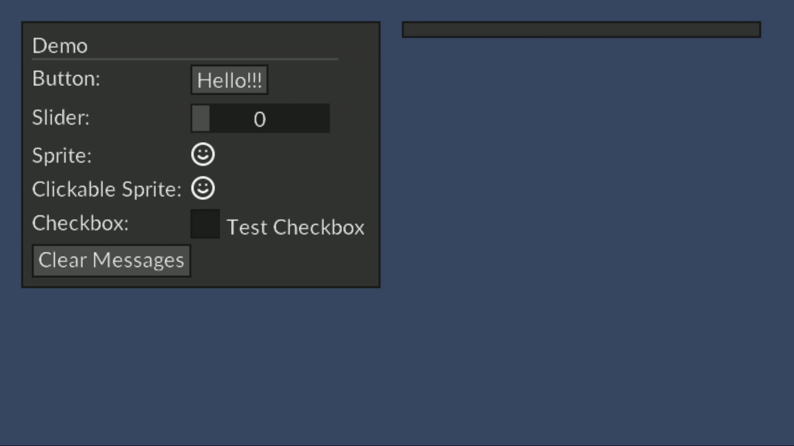

# Mika

UI library built for MonoGame and FNA.

## Features

- Immediate-mode API for building the user interface
- Written in .NET Standard 2.0
- Support input from mouse, keyboard, and gamepad
- Fully customizable theme
- Simple event listener

## Screenshot



## Example

```cs

using Microsoft.Xna.Framework;
using Mika;

public class Game1 : Game {

  private Context _mika;

  // ...

  public override void LoadContent() {
    // ...

    _mika = new Context(GraphicsDevice);

    // ...
  }

  public override void Draw(GameTime gameTime) {
    _mika.Begin();

    // Build your UI here

    // Example:
    _mika.Panel();
      _mika.Text("Hello World!");
    _mika.ClosePanel();

    // Draw the UI

    _mika.Render(_spriteBatch);
  }
}

```
